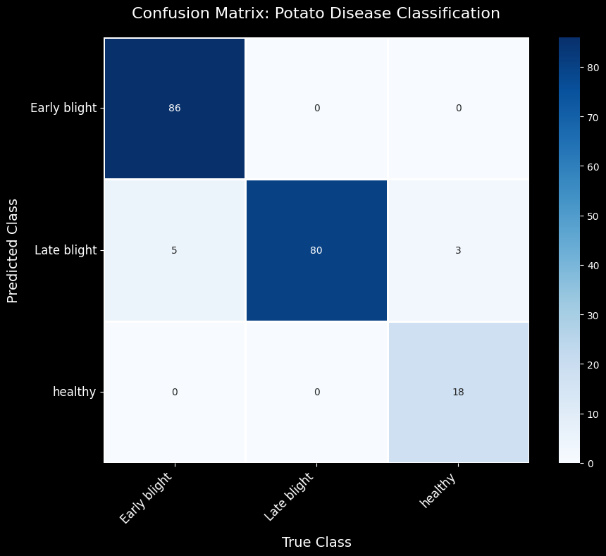

# 🥔 Potato Disease Detection Using Deep Learning

[](https://python.org)
[](https://tensorflow.org)
[](https://gradio.app)
[](LICENSE)
[](https://huggingface.co/spaces/YOUR_USERNAME/potato-disease-detection)

An AI-powered web application that detects diseases in potato plants using Convolutional Neural Networks (CNNs). The system can identify **Early Blight**, **Late Blight**, and **Healthy** potato leaves with high accuracy.

## 🌟 Features

- **Real-time Disease Detection**: Upload potato leaf images for instant analysis
- **High Accuracy**: Achieves 95.83% accuracy on test dataset  
- **Interactive Web Interface**: User-friendly Gradio-based application
- **Detailed Analysis**: Provides disease information, treatment recommendations, and confidence scores
- **Visual Insights**: Probability distribution charts for all disease classes
- **Mobile Friendly**: Responsive design works on all devices

## 🚀 Live Demo

Try the live application: **[🤗 Potato Disease Detector on Hugging Face Spaces](https://huggingface.co/spaces/PuspenduHF/DL-Potato-Disease-Classification)**

## 🎯 Disease Classes

The model can detect three main categories:

| Class            | Description                                                                  | Severity |
|------------------|------------------------------------------------------------------------------|----------|
| **Early Blight** | Caused by *Alternaria solani*. Dark spots with concentric rings on leaves    | Moderate |
| **Late Blight**  | Caused by *Phytophthora infestans*. Rapid leaf destruction with dark patches | High     |
| **Healthy**      | No visible signs of disease                                                  | None     |

## 🛠️ Installation

### Prerequisites
- Python 3.11+
- pip package manager

### Setup Instructions

1. **Clone the repository**
   ```bash
   git clone https://github.com/Pushtogithub23/potato-disease-classification.git
   cd potato-disease-classification
   ```

2. **Create virtual environment**
   ```bash
   python -m venv venv
   source venv/bin/activate  # On Windows: venv\Scripts\activate
   ```

3. **Install dependencies**
   ```bash
   pip install -r requirements.txt
   ```

4. **Run the application**
   ```bash
   python app.py
   ```

5. **Open your browser**
   Navigate to `http://localhost:7860` to use the application

## 📁 Project Structure
```

potato-disease-classification/
├── app.py                          # Main Gradio application
├── Potato_disease_detection.ipynb  # Complete ML pipeline notebook
├── requirements.txt                # Python dependencies
├── SAVED_MODELS/                   # Trained model files
│   └── model_1.keras
├── PotatoDir/                   # Potato disease directory
│   ├── Potato___Early_blight
|   ├── Potato___healthy
|   ├── Potato___Late_blight
├── TEST_IMAGES/                    # Sample test images
│   ├── Early_Blight.JPG
│   ├── Late_Blight.JPG
│   └── Healthy.JPG
├── RESULTS/                        # Model evaluation results
│   ├── cm.png                      # Confusion matrix visualization
│   └── model_predictions.png       # Sample predictions visualization
└── README.md                       # Project documentation
```
## 🔬 Model Architecture

The CNN model features:
- **Input**: 256×256×3 RGB images
- **Architecture**: four Convolutional blocks with progressive filter increase (32→64→128→256)
- **Data Augmentation**: Random rotation, zoom, and flip transformations
- **Optimization**: Adam optimizer with early stopping
- **Output**: Softmax classification for three disease classes

## 📊 Model Performance

- **Test Accuracy**: 95.83%
- **Dataset**: PlantVillage potato disease images
- **Training**: 80/10/10 train/validation/test split
- **Preprocessing**: Image normalization and augmentation

### Classification Report

```
              precision    recall  f1-score   support

Early blight     0.9451    1.0000    0.9718        86
 Late blight     1.0000    0.9091    0.9524        88
     healthy     0.8571    1.0000    0.9231        18

    accuracy                         0.9583       192
   macro avg     0.9341    0.9697    0.9491       192
weighted avg     0.9620    0.9583    0.9583       192
```

## 🖼️ How to Use

1. **Upload Image**: Click on the upload area or drag & drop a potato leaf image
2. **Analyze**: The model automatically processes the image upon upload
3. **Review Results**: 
   - View the predicted disease class and confidence score
   - Check the probability distribution chart
   - Read disease information and treatment recommendations

### Supported Image Formats
- JPEG/JPG
- PNG
- WebP

## 📈 Technical Details

### Data Processing Pipeline
- Image resizing to 256×256 pixels
- Pixel normalization (0-255 → 0-1 range)
- Data augmentation for training robustness

### Model Training
- **Framework**: TensorFlow 2.x
- **Loss Function**: Sparse Categorical Crossentropy
- **Metrics**: Accuracy
- **Callbacks**: Early stopping to prevent overfitting

## 📊 Model Evaluation Visualizations

### Confusion Matrix

The confusion matrix shows the model's prediction performance across all classes:



### Sample Predictions

Here are some examples of the model's predictions on test images:


## 📋 Requirements

See `requirements.txt` for the complete list of dependencies:

- tensorflow
- scikit-learn
- gradio
- pandas
- numpy
- matplotlib
- plotly
- seaborn
- tqdm

## 🔍 Future Enhancements

- [ ] Add more potato disease classes
- [ ] Implement batch processing for multiple images
- [ ] Add mobile app version
- [ ] Include severity assessment
- [ ] Multi-language support
- [ ] Historical analysis dashboard

## ⚠️ Important Notes

- This tool is designed for educational and research purposes
- For critical agricultural decisions, always consult with plant pathologists or agricultural experts
- Ensure good image quality and lighting for optimal results
- The model works best with clear images of potato leaves

## 📄 License

This project is licensed under the MIT License—see the [LICENSE](LICENSE) file for details.

## 🙏 Acknowledgments

- **PlantVillage Dataset** for providing the training images
- **TensorFlow** team for the deep learning framework
- **Gradio** team for the intuitive web interface tools
- **Hugging Face** for hosting the live demo


---

<div align="center">
  <b>🌱 Help farmers protect their potato crops with AI! 🌱</b>
</div>
